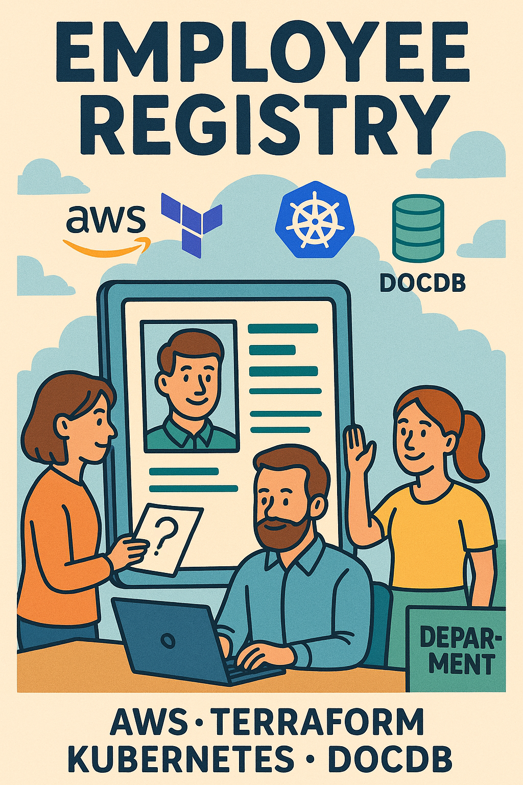

# EMPLOYEE REGISTRY 



> [!NOTE]
> This project is under active development.

## Built with

* [![Express.js][Express.js]][Express.js-url]
* [![React][React.js]][React-url]
* [![Terraform][Terraform]][Terraform-url]
* [![AWS][AWS]][AWS-url]
* [![Docker][Docker]][Docker-url]
* [![Kubernetes][Kubernetes]][Kubernetes-url]
* [![DocumentDB][DocumentDB]][DocumentDB-url]

## Installation
1. Clone the repository
```bash
git clone https://github.com/KataSugar/EmployeeRegistry.git
```

2. Install dependencies
```bash
cd server
npm install
cd.. 
cd client
npm install
cd..
```

3. Initialize and run Terraform
```bash
cd terraform
terraform init
terraform plan
terraform apply
```


<p align="left">(<a href="#readme-top">back to top</a>)</p>


<!-- MARKDOWN LINKS & IMAGES -->

[React.js]: https://img.shields.io/badge/React-20232A?style=for-the-badge&logo=react&logoColor=61DAFB
[React-url]: https://reactjs.org
[Terraform]: https://img.shields.io/badge/Terraform-7B42BC?style=for-the-badge&logo=terraform&logoColor=white
[Terraform-url]: https://www.terraform.io
[AWS]: https://img.shields.io/badge/AWS-232F3E?style=for-the-badge&logo=amazonaws&logoColor=white
[AWS-url]: https://aws.amazon.com
[Docker]: https://img.shields.io/badge/Docker-0db7ed?style=for-the-badge&logo=docker&logoColor=white
[Docker-url]: https://www.docker.com
[Kubernetes]: https://img.shields.io/badge/Kubernetes-326ce5?style=for-the-badge&logo=kubernetes&logoColor=white
[Kubernetes-url]: https://kubernetes.io
[DocumentDB]: https://img.shields.io/badge/DocumentDB-232F3E?style=for-the-badge&logo=amazonaws&logoColor=white
[DocumentDB-url]: https://aws.amazon.com/documentdb
[Express.js]: https://img.shields.io/badge/Express.js-404d59?style=for-the-badge&logo=express&logoColor=white
[Express.js-url]: https://expressjs.com